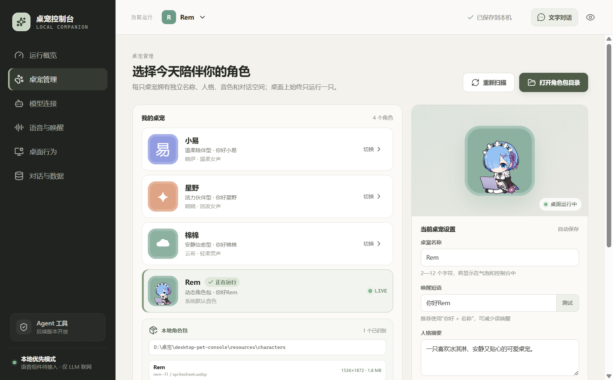
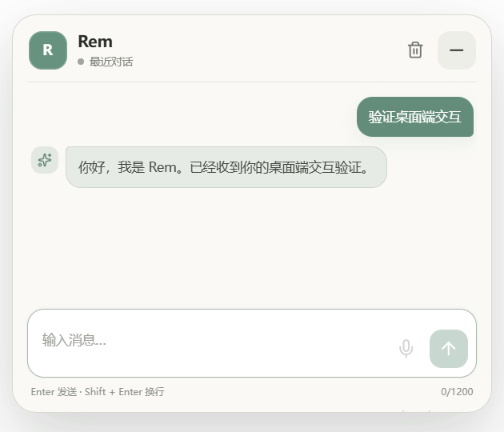

# 小依桌宠（Xiaoyi Desktop Pet）

[](https://github.com/followTheWind223/xiaoyi-desktop-pet/releases/latest)
[](https://github.com/followTheWind223/xiaoyi-desktop-pet/releases/latest)
[](https://www.electronjs.org/)
[](https://vuejs.org/)

一款面向 Windows 的本地桌面宠物应用。支持 Hatch-Pet 风格的 WebP 精灵角色包、桌面动作与拖拽、OpenAI-compatible AI 对话、安全配置持久化，以及用于管理角色、模型和桌面行为的可视化控制台。

> 当前版本：`v0.3.1`。这是可安装、可卸载、可升级保留配置的早期版本；语音运行时和 Agent 工具仍在开发中。

## 下载与安装

前往 [Releases](https://github.com/followTheWind223/xiaoyi-desktop-pet/releases/latest) 下载：

- `Xiaoyi-Desktop-Pet-Setup-0.3.1-x64.exe`：推荐普通用户使用。安装向导支持选择当前用户或所有用户、自定义安装路径、创建桌面与开始菜单快捷方式。
- `Xiaoyi-Desktop-Pet-Portable-0.3.1-x64.exe`：免安装便携版，适合临时体验和开发验证。

安装目录中的 `Uninstall 桌宠.exe` 可以移除主程序、运行库和快捷方式。卸载默认保留 `%APPDATA%\桌宠` 中的角色包、模型设置和聊天历史，重新安装或升级时可继续使用。

本地构建未配置公开代码签名证书，Windows SmartScreen 可能显示未知发布者提示。

## 界面预览



| 桌宠快捷回复气泡 | 完整对话窗口 |
| --- | --- |
|  |  |

## 已实现功能

- 透明置顶桌宠窗口、系统托盘和独立控制台。
- Hatch-Pet `pet.json + spritesheet.webp` 角色包扫描、校验与动态加载。
- 自定义图集规格、动作目录、逐行动画预览和透明空帧检测。
- 待机、招呼、拖拽、等待回复、回答、错误以及左右移动状态映射。
- 左右动作驱动桌宠窗口真实移动；待机时低频自动散步，并限制在显示器工作区内。
- “允许桌宠自主移动”与“待机自动散步”分级设置；关闭自主移动后仍可手动拖拽。
- 控制台支持在 70%～130% 间连续调整桌宠大小；右键菜单提供 75%、100% 和 125% 快捷档位，比例与位置会跨重启恢复。
- 右键“展示动作”会读取当前角色包的完整动作目录，支持直接选择并预览。
- 单击打开桌宠下方半透明快捷输入，不缩小角色；悬停、等待输入、等待模型和输出期间均持续播放对应动作。
- 未选择模型或缺少 API Key 时直接显示配置引导，可一键跳转到控制台“模型连接”。
- 回复以桌宠头顶气泡流式展示，默认保留 10 秒，可在右键菜单或控制台调整为 5～30 秒。
- 右键“打开完整对话”进入原有历史聊天窗口；支持短拖拽、长按拖拽、位置锁定、边缘吸附和点击穿透。
- OpenAI-compatible `/chat/completions`，支持 SSE 流式回复、非流式 JSON、停止回答、超时和错误提示。
- 快捷输入、独立完整对话窗口、按角色隔离的最近对话和本机历史恢复。
- 模型、角色、桌面行为等设置的用户级持久化。
- API Key 使用 Electron `safeStorage` 和 Windows DPAPI 加密，不写入普通配置或 localStorage。
- NSIS 安装包、便携版、自定义安装路径和标准卸载程序。

## 基本操作

- 单击桌宠：在桌宠下方打开快捷输入，回复会显示在头顶气泡中。
- 拖动桌宠：移动到桌面其他位置。
- 长按约 `350ms` 后拖动：进入明确的移动模式。
- 右键桌宠：打开原生菜单，可进入完整对话、调整桌宠大小与回复气泡停留时间、选择动作、切换角色或修改窗口行为。
- `Ctrl + Alt + Enter`：打开完整对话窗口。
- `Ctrl + Alt + P`：启用或恢复点击穿透。

关闭控制台中的“待机动作”后，桌宠不会自动散步。打开对话、锁定位置、隐藏桌宠或启用点击穿透时，正在进行的自动移动会立即停止。

## AI 模型配置

进入“模型连接”页面，填写：

- Model URL，例如 `https://api.openai.com/v1` 或其他 OpenAI-compatible 地址。
- API Key。
- 模型 ID，例如 `gpt-4o-mini`、`deepseek-chat` 或服务商提供的其他模型名。

点击“测试连接”会发送一个最小真实请求。API Key 保存后不会在界面中回显，普通配置与密钥分别存放：

```text
%APPDATA%\桌宠\desktop-pet-data\console-settings.json
%APPDATA%\桌宠\desktop-pet-data\model-api-key.bin
%APPDATA%\桌宠\desktop-pet-data\chat-history.json
```

密钥由当前 Windows 登录账户加密；更换账户或电脑后需要重新输入。包含账号密码或敏感查询参数的 Model URL 不会被持久化。

## 本地角色包

开发环境中的角色包目录：

```text
resources\characters\<角色文件夹>\
```

安装版首次启动后会把内置角色包复制到用户可写目录：

```text
%APPDATA%\桌宠\characters\<角色文件夹>\
```

每个角色文件夹至少包含：

```text
pet.json
spritesheet.webp
```

最小配置：

```json
{
  "id": "demo-pet",
  "displayName": "Demo 桌宠",
  "description": "桌宠简介",
  "spritesheetPath": "spritesheet.webp"
}
```

自定义图集与动作目录：

```json
{
  "atlas": { "columns": 8, "rows": 9 },
  "animations": [
    { "id": "idle", "label": "待机", "row": 0, "mode": "loop", "states": ["idle"] },
    { "id": "running-right", "label": "向右跑", "row": 1, "mode": "loop", "states": ["moving_right"] },
    { "id": "running-left", "label": "向左跑", "row": 2, "mode": "loop", "states": ["moving_left"] },
    { "id": "wave", "label": "挥手", "row": 3, "mode": "once", "states": ["hover"] },
    { "id": "special", "label": "特殊动作", "row": 8, "mode": "loop", "states": [] }
  ]
}
```

`states` 用来绑定运行状态；留空的动作仍会出现在“桌宠管理 → 完整动作库”中供手动预览。旧角色包如果使用 `running-right` / `running-left` 动作 ID，即使未声明 `states`，也会自动绑定左右移动。

当前限制：单个图集最多 `64×64` 格、64 个动作、JSON 256KB、WebP 64MB。扫描器只读取角色根目录的一级子目录，并拒绝符号链接、目录穿越和非 WebP 精灵表。

## 开发运行

要求：Windows、Node.js 20 或更高版本、npm。

```powershell
git clone https://github.com/followTheWind223/xiaoyi-desktop-pet.git
cd xiaoyi-desktop-pet
npm install
npm run desktop
```

`npm run desktop` 会先构建前端再启动 Electron。已经构建后可使用：

```powershell
npm run desktop:open
```

也可以双击项目根目录中的 `启动桌宠控制台.cmd`。

仅运行浏览器控制台 UI：

```powershell
npm run dev
```

浏览器模式用于界面开发，不具备透明桌宠窗口、Windows 加密密钥和完整主进程能力。

## 构建与测试

```powershell
npm run build
npm run smoke:characters
npm run smoke:desktop
npm run smoke:settings
```

生成 Windows 安装版与便携版：

```powershell
npm run dist:win
```

产物位于 `release`：

```text
桌宠-Setup-<版本>-x64.exe
桌宠-Portable-<版本>-x64.exe
win-unpacked\桌宠.exe
```

打包完成后可继续验证：

```powershell
npm run smoke:packaged
npm run smoke:settings:packaged
npm audit --audit-level=high
```

## 项目结构

```text
electron/                  Electron 主进程、IPC、角色扫描和安全存储
resources/characters/      开发环境内置角色包
scripts/                   自动化与桌面回归测试
src/                       Vue 控制台、桌宠窗口和对话气泡
src-tauri/                 后续 Tauri/Rust 迁移实验代码
build/                     应用图标与打包资源
artifacts/                 README 截图和测试预览
```

## 当前边界与路线

当前已经完成桌宠、角色包、AI Chat、设置持久化和 Windows 分发的基础闭环。后续重点：

- 本地语音识别、唤醒词、TTS 按句播放和口型/动作联动。
- 角色包导入事务、复制进度、冲突处理和回滚。
- 多 WebP、Live2D 与更灵活的动作状态机。
- Tool Calling 权限执行器、审计记录和 Agent 工具扩展。
- SQLite 会话存储、摘要压缩、会话搜索和数据导出。
- 自动更新、正式代码签名和干净 Windows 环境的升级/卸载验证。

## 安全设计

- 页面使用本地 `file://` 加载，不启动 Web 服务或监听端口。
- Renderer 关闭 Node.js 集成，启用 `contextIsolation`、沙箱和 CSP。
- 页面不能直接联网；模型请求由受控主进程通道发出。
- 默认拒绝麦克风、摄像头等权限请求。
- IPC 使用发送方校验与白名单接口，角色资料进入主进程后再次清洗。
- API Key 与普通 JSON 配置分离，并使用 Windows DPAPI 加密。
